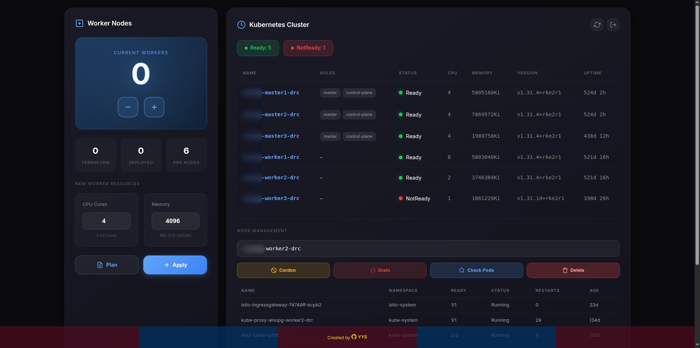

# RKE2 Proxmox Autoscaler

Dashboard untuk scaling worker node kluster Kubernetes (RKE2) di Proxmox. Fetch nodes/templates dinamis, setup wizard, node management (cordon/drain/delete), monitoring uptime, token auth dengan auto-logout. Credential di `.env`, tidak di-hardcode.



## Features

- Scale worker VM up/down via dashboard
- Setup wizard untuk konfigurasi Proxmox & Kubernetes
- Fetch available Proxmox nodes dan templates secara dinamis
- Node management: cordon, drain, delete dari K8s
- Monitoring uptime node K8s
- Token-based authentication dengan auto-logout

## Tech Stack

- Flask (Python) - backend dashboard
- Terraform - provisioning VM di Proxmox
- Proxmox API - management node/template
- Kubernetes API - node lifecycle management

## Deploy dengan Docker Compose

### 1. Clone atau copy project ke server

```bash
git clone https://github.com/yoniys94/rke2-proxmox-autoscaler-ui.git
cd rke2-proxmox-autoscaler-ui
```

### 2. Create `.env` dan `kubeconfig` files

**Penting**: Docker akan otomatis membuat directory jika file tidak ada. Pastikan file (bukan directory) dibuat sebelum start container.

```bash
# Hapus jika ada (file atau directory)
rm -rf .env kubeconfig .kubeconfig

# Buat file kosong
touch .env kubeconfig
chmod 666 .env kubeconfig

# Verify - harus muncul -rw-rw-r-- (regular file)
ls -la .env kubeconfig
```

### 3. Start container

```bash
docker compose up -d
```

### 4. Akses dashboard

Buka browser: `http://<server-ip>:5000`

## Setup Dashboard (Pertama Kali)

### 1. Login ke Setup Wizard

Saat pertama kali akses, akan redirect ke `/setup`. Masukkan:

- **Proxmox API Endpoint** - format: `https://<IP>:<PORT>/api2/json/`
- **Username** - contoh: `root@pam`
- **Password** - password Proxmox
- **VM Root Password** - password untuk VM worker (cloud-init)
- **Dashboard Password** - password untuk akses dashboard

### 2. Fetch Nodes & Templates

Klik button **"Fetch Nodes & Templates"** untuk load daftar node dan template dari Proxmox secara dinamis.

### 3. Assign Template per Node

Pilih template VM untuk setiap node Proxmox.

### 4. Masukkan Kubeconfig

Paste kubeconfig YAML untuk cluster RKE2.

### 5. Save Configuration

Klik **"Save Configuration"**. Setelah saved, akan redirect ke dashboard utama.

## Konfigurasi Lanjutan

### Environment Variables (.env)

```env
# Proxmox Connection
PROXMOX_ENDPOINT="https://10.12.0.1:8006/api2/json/"
PROXMOX_USERNAME="root@pam"
PROXMOX_PASSWORD="your-proxmox-password"

# VM root password (for cloud-init)
VM_PASSWORD="your-vm-password"

# Dashboard Authentication
DASHBOARD_PASSWORD="your-dashboard-password"
DASHBOARD_TOKEN="auto-generated"

# Template per Node (JSON string)
TEMPLATE_PER_NODE='{"node-name": template-vmid}'
```

### Terraform Variables (terraform.tfvars)

```hcl
worker_count = 0          # Jumlah worker (0 = destroy all)
worker_cpu = 2             # CPU cores per worker
worker_memory = 4096       # Memory MB per worker
```

## Volume Mount

Data berikut persist di host via volume mount:

| Host Path | Container Path | Description |
|-----------|---------------|-------------|
| `./.env` | `/app/.env` | Configuration |
| `./kubeconfig` | `/app/kubeconfig` | Kubernetes config |
| `./terraform.tfstate` | `/app/terraform/terraform.tfstate` | Terraform state |
| `.` | `/app/terraform` | Terraform files |

## Troubleshooting

### Container tidak start?
```bash
docker compose logs -f
```

### Check container status:
```bash
docker compose ps
```

### Restart container:
```bash
docker compose restart
```

### Rebuild dari awal:
```bash
docker compose down
docker compose build --no-cache
docker compose up -d
```

### Error: "Is a directory: '/app/.env'" atau "/app/kubeconfig"

Docker membuat directory kosong jika file tidak ada. Fix:

```bash
docker compose down
rm -rf .env kubeconfig .kubeconfig
touch .env kubeconfig
chmod 666 .env kubeconfig
ls -la .env kubeconfig  # verify file, bukan directory
docker compose up -d
```